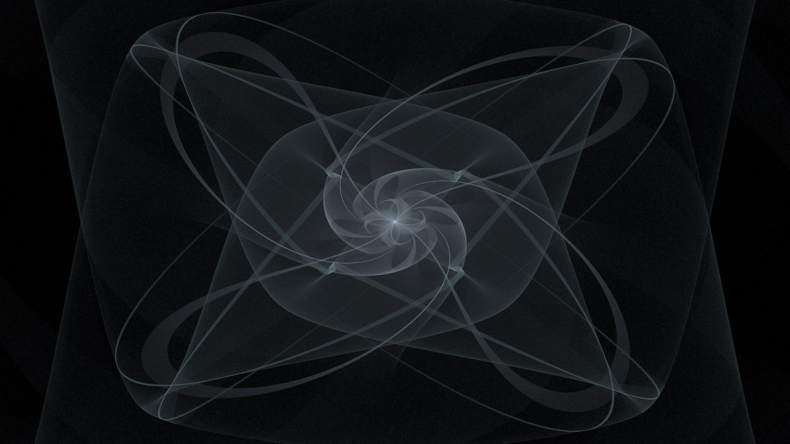
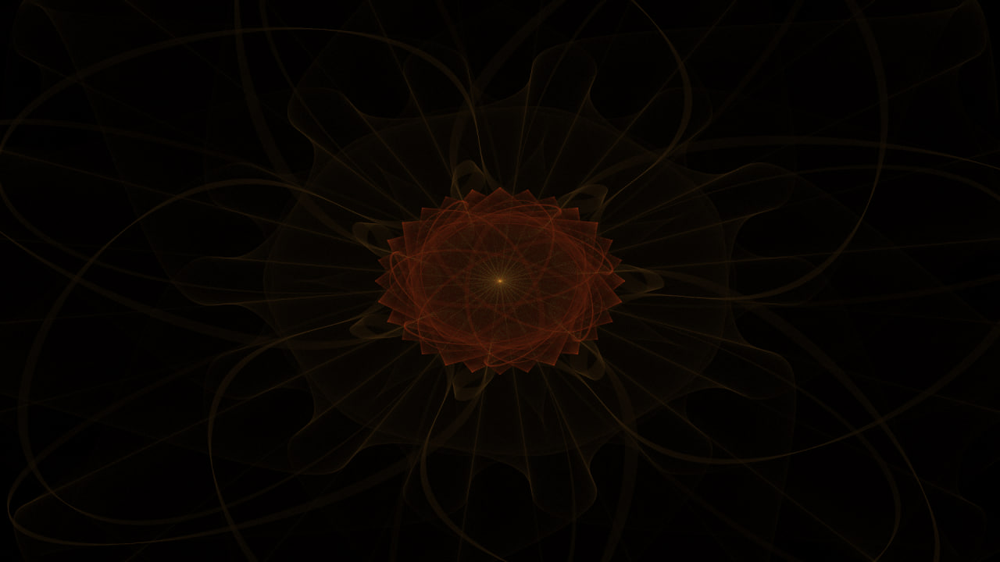
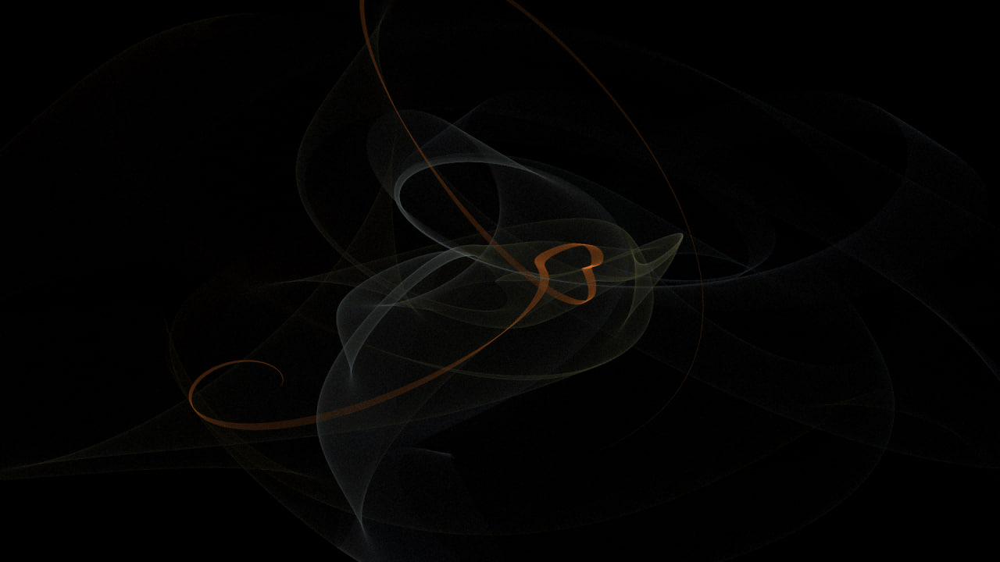
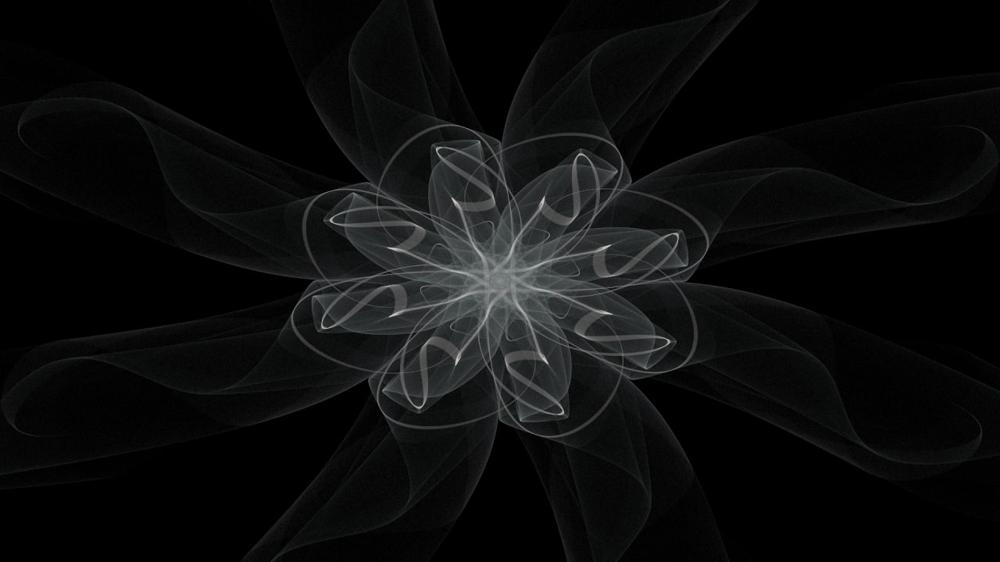

# Fractal flame generator

The library generates fractal flame images based on Chaos Game algorithm and the article by Scott Draves. 
You may pass the config file as the first command-line argument to configure the generator. The example of the config:
```json
{
"threads": 16,
"variations": [
    {
        "name": "Heart",
        "weight": 0.8
    },
    {
        "name": "Hyperbolic",
        "weight": 0.2
    }
],
"colors": [
    "#ebf2fa"
],
"symmetry": 2,
"samplesNum": 1000000,
"output": "RESULT.png"
}
```
* **threads** - the number of thread to run in parallel
* **width** - the width of the image
* **height** - the height of the image
* **variations** - the list of variation transform to apply to the point and its weight. 
Supported variations: "Bent", "Diamond", "Disc", "Ex", "Fisheye", "Handkerchief", "Heart", "Horseshoe", "Hyperbolic", "Sinusoidal", "Spherical", "Spiral", "Swirl"
* **colors** - colors to use in image, at the same time - the number of different affine transform to apply
* **symmetry** - the type of symmetrization. Specifically, the number of times each point will be rotated by **2π / symmetry** radians
* **samplesNum** - the number of point on image
* **output** - the path to the output file
* **gamma** - the gamma coefficient for the brightness-gamma correction
* **iterPerSample** - the number of iterations in which one sample will be transformed (should be >20)
* **xBound** - the initial x-coordinate of the rectangle with (-**xBound**, -**yBound**) lower left point and 2\***xBound** width and 2\***yBound** height to take the start points from 
* **yBound** - the initial y-coordinate of the rectangle
* **seed** - the seed for the random

More details of the parameters can be found in the [original article](https://flam3.com/flame_draves.pdf).

# Some examples of generated images

<p align="center">




</p>

[//]: # (![flame 1]&#40;flame1.jpg&#41;)
[//]: # (![flame 2]&#40;flame2.jpg&#41;)
[//]: # (![flame 3]&#40;flame3.jpg&#41;)
[//]: # (![flame 4]&#40;flame4.jpg&#41;)
